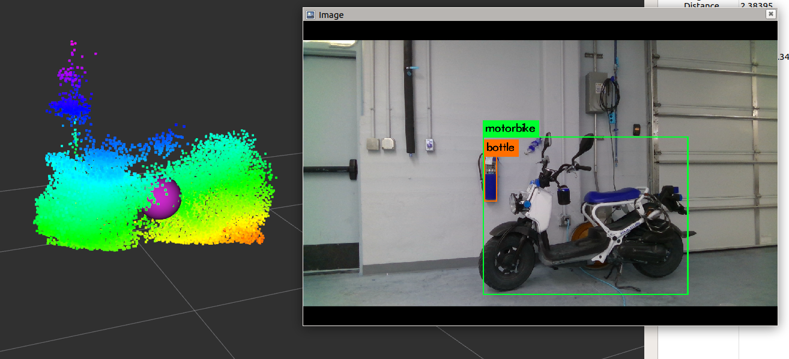

# Object Detection package for ROS

## Overview

This repo is a collection of ROS packages designed to easily allow a robot to fuse a 2D object detection model with LiDAR data to obtain and track static objects in the environment.

The primary node used here is `object_pose_estimation` but there are a few other nodes that may have some use in certain contexts.

### YOLO

Though you don't necessarily need to use YOLO to compile this package, you need to build [darknet_ros_msgs](https://github.com/leggedrobotics/darknet_ros/tree/master/darknet_ros_msgs) and your object detection model does need to output a topic of type `darknet_ros_msgs/BoundBoxes.msg`

Please follow instructions from https://github.com/leggedrobotics/darknet_ros

For more information about YOLO, Darknet, available training data and training YOLO see the following link: [YOLO: Real-Time Object Detection](http://pjreddie.com/darknet/yolo/).

### ROS Packages

#### detecton_msgs

Simply contains a custom ROS msg for Detection information and an message for an array of that type.

#### image_processing

This package contains one node that make it simpler to get a single snapshot from a camera stream via ROS

##### image_snapshot

###### Subscribers

- `image` - Type: sensor_msgs/Image
- `image/compressed` - Type: sensor_msgs/CompressedImage
- `camera_info` - Type: sensor_msgs/CameraInfo

###### Service Server

- `send_snapshot`
    - Type: image_processing/Snapshot
    - Return: CameraInfo if available. Image if img_valid is True and CompressedImage if cimg_valid is True. 

#### object_detection

This ROS package simply contains pre-made launch and config files used to run the various nodes and services offered by this repo.  The more sophisticated launch files are made to integrate directly with a mobile robot without too much if any reworking.

#### pointcloud_processing

This ROS package is where the magic happens with the Object detection model fusing with LiDAR data to track static objects in the environment.  This package contains two nodes.

##### object_detection_streamer

This node was made in the process of making the larger and more sophisticated `object_pose_estimation`.  This node takes in the same inputs as the pose estimation node and provides a live view of the filtered LiDAR data for each tracked object inside of its bounding box.

Figure 1: Object detection streamer example output from 2021. A person is detected via YOLO and the lidar is filtered down to the area of the bounding box.

###### Subscribers

- `bounding_boxes` 
    - Type: darknet_ros_msgs/BoundingBoxes
    - Note: Live bounding box information generated from your desired object detection model.  Class, probability, and the bounding boxes must be valid.
- `camera_info`
    - Type: sensor_msgs/CameraInfo
    - Note: This data must be correct and valid for the camera including TF frame
- `pointcloud`
    - Type: sensor_msgs/PointCloud2
    - Note: The entire pointcloud coming from a LiDAR or any other sensor generating a valid pointcloud with proper TF frame

###### Publishers

- `detections`
    - Type: vision_msgs/Detection3DArray
    - Note: output of all processed detections with associated pointcloud
- `camera_fov_cloud`
    - Type: sensor_msgs/PointCloud2
    - Note: the input pointcloud after it has been filtered down to the FOV of the camera.  This is used more for debugging to ensure your sensor data and their transforms are setup properly.
- `detection_cloud`
    - Type: sensor_msgs/PointCloud2
    - Note: the input pointcloud after it has been filtered down to each detections' bounding box. This should look like a flashlight version of the pointcloud that is shining on the object(s) you are detecting.

###### Params

- `object_classes`
    - Type: vector<string> (see example.yaml for this)
    - Note: REQUIRED. List of all the object class types you want to detect. These string must match with the output from your model's darknet bounding boxes output.
- `robot_frame`
    - Type: string
    - Default: `base_link`
    - Note: Base frame of the robot. MUST BE VALID!
- `camera_optical_frame`
    - Type: string
    - Default: `camera_optical_frame`
    - Note: The ***optical*** frame of the camera. Generally this frame is in Z-forward, X-right relative to the base camera link. MUST BE VALID!
- `pointcloud_stale_time`
    - Type: double
    - Default: 0.05
    - Note: In the pointcloud callback the pointcloud timestamp is checked to ensure that the pointcloud is not older than this value in seconds. If so, it is ignored.
- `confidence_threshold`
    - Type: double
    - Default: 0.75
    - Note: this value determines whether object detected should be processed.  The probability from the detection in the bounding boxes message must be higher than this value for the object to processed and output by this node.
- `bbox_pixel_padding`
    - Type: int
    - Default: 0
    - Note: Number of pixels (in all directions) to add or subtract from the incoming bounding boxes when processing the detections.  Less means a tighter bounding box. More opens up the bounding box.
- `bbox_edge`
    - Type: bool
    - Default: true
    - Note: When true, this node will check to see if the bounding box is within `bbox_edge_x`% of the edge of the image in the width direction and `bbox_edge_y`% of the edge of the image in height direction.  If so, it will ignore that bounding box until the bounding box is closer to the center.
- `bbox_edge_x`
    - Type: double
    - Default: 0.1
    - Note: only used if `bbox_edge` is True.  This means by default any bounding box that is within the 10% of the far left or far right of the image will be ignored.
- `bbox_edge_y`
    - Type: double
    - Default: 0.01
    - Note: only used if `bbox_edge` is True.  This means by default any bounding box that is within the 1% of the top or bottom of the image will be ignored.

##### object_pose_estimation

This node tracks the position of objects detected in the environment by a mobile robot.  It assumes the objects are static for this pose estimation and tracking.

Figure 2: Object pose estimation example output from 2022. A motorbike is detected with 10 different views via YOLO.  All of the combined LiDAR data is filtered among the different views to produce a single pointcloud and a centroid (pointstamped).

###### Subscribers

- `bounding_boxes` 
    - Type: darknet_ros_msgs/BoundingBoxes
    - Note: Live bounding box information generated from your desired object detection model.  Class, probability, and the bounding boxes must be valid.
- `camera_info`
    - Type: sensor_msgs/CameraInfo
    - Note: This data must be correct and valid for the camera including TF frame
- `pointcloud`
    - Type: sensor_msgs/PointCloud2
    - Note: The entire pointcloud coming from a LiDAR or any other sensor generating a valid pointcloud with proper TF frame

###### Publishers

- `detection`
    - Type: detection_msgs/Detection
    - Note: output of a single processed detection
- `detected_objects`
    - Type: detection_msgs/DetectionArray
    - Note: output of all detected objects and their associated data once a new sighting is registered
- `camera_fov_cloud`
    - Type: sensor_msgs/PointCloud2
    - Note: the input pointcloud after it has been filtered down to the FOV of the camera.  This is used more for debugging to ensure your sensor data and their transforms are setup properly.
- `detection_cloud`
    - Type: sensor_msgs/PointCloud2
    - Note: the input pointcloud after it has been filtered down to each detections' bounding box. This should look like a flashlight version of the pointcloud that is shining on the object(s) you are detecting.

###### Service Servers

- `publish_data`
    - Type: std_srvs/Empty
    - Note: this simply triggers a publish of `detected_objects`
- `save_bag`
    - Type: std_srvs/Empty
    - Note: this triggers a bag save of all currently stored detection data

###### Service Clients

- `image_snapshot/send_snapshot`
    - Type: image_processing/Snapshot
    - Note: this must be properly connected to the image snapshot service server for any detection images to be stored

###### Params

- `object_classes`
    - Type: vector<string> (see example.yaml for this)
    - Note: REQUIRED. List of all the object class types you want to detect. These string must match with the output from your model's darknet bounding boxes output.
- `robot_frame`
    - Type: string
    - Default: `base_link`
    - Note: Base frame of the robot. MUST BE VALID!
- `camera_optical_frame`
    - Type: string
    - Default: `camera_optical_frame`
    - Note: The ***optical*** frame of the camera. Generally this frame is in Z-forward, X-right relative to the base camera link. MUST BE VALID!
- `map_frame`
    - Type: string
    - Default: `map`
    - Note: The map frame (or world frame) which is the static reference frame for robot navigation. MUST BE VALID!
- `pointcloud_stale_time`
    - Type: double
    - Default: 0.05
    - Note: In the pointcloud callback the pointcloud timestamp is checked to ensure that the pointcloud is not older than this value in seconds. If so, it is ignored.
- `confidence_threshold`
    - Type: double
    - Default: 0.75
    - Note: this value determines whether object detected should be processed.  The probability from the detection in the bounding boxes message must be higher than this value for the object to processed and output by this node.
- `robot_movement_threshold` 
    - Type: double
    - Default: 2.0
    - Note: The minimum distance in meters the robot needs to travel before it begins looking for a new object.  It is reset once a object is seen.
- `robot_turning_threshold`
    - Type: double
    - Default: 0.1
    - Note: the amount (in radians per cycle) that the robot's orientation can rotate before looking for a object.  Generally, it is object pose estimate works best if the robot is not rotating while a object is detected.  This allows for the user to tune how much their robot rotation affects object pose estimate.  
- `distance_between_objects` 
    - Type: double
    - Default: 10.0
    - Note: if a object is seen but cannot be matched with a previously observed object it will check if the estimated pose of the new detection is within this distance from a previously observed object.  If it is then this new data will be tossed out as an anomaly that it could not be registered.  Generally this would occur if robot localization is not perfect.
- `sleep_period`
    - Type: double
    - Default: 0.1
    - Note: the time (in seconds) to sleep in between ROS cycles.  
- `bbox_pixel_padding`
    - Type: int
    - Default: 0
    - Note: Number of pixels (in all directions) to add or subtract from the incoming bounding boxes when processing the detections.  Less means a tighter bounding box. More opens up the bounding box.
- `bbox_edge`
    - Type: bool
    - Default: true
    - Note: When true, this node will check to see if the bounding box is within `bbox_edge_x`% of the edge of the image in the width direction and `bbox_edge_y`% of the edge of the image in height direction.  If so, it will ignore that bounding box until the bounding box is closer to the center.
- `bbox_edge_x`
    - Type: double
    - Default: 0.1
    - Note: only used if `bbox_edge` is True.  This means by default any bounding box that is within the 10% of the far left or far right of the image will be ignored.
- `bbox_edge_y`
    - Type: double
    - Default: 0.01
    - Note: only used if `bbox_edge` is True.  This means by default any bounding box that is within the 1% of the top or bottom of the image will be ignored.
- `save_all_detection_data`
    - Type: bool
    - Default: true
    - Note: if true this node will save images and raw more detailed pointclouds and tfs from each view of each detection
- `save_data_directory`
    - Type: string
    - Default: "/home"
    - Note: the directory where you prefer all the detection data (bags and images) to be stored if `save_all_detection_data` is enabled
- `save_bag_on_shutdown`
    - Type: bool
    - Default: false
    - Note: saves a bag of all in the data in object_detections_ when the node is shutdown. A bag can also be saved by calling the `save_bag` service. 
- `data_hosting_enabled`
    - Type: bool
    - Default: true
    - Note: if `save_all_detection_data` is enabled and this is true the output urls for each image will be an http formatted url file path.
- `data_hosting_address`
    - Type: string
    - Default: 'localhost'
    - Note: if `save_all_detection_data` is enabled and `data_hosting_enabled` is true this will be IP address for the image url for each detection.
- `data_hosting_port`
    - Type: int
    - Default: 4002
    - Note: if `save_all_detection_data` is enabled and `data_hosting_enabled` is true this will be IP port for the image url for each detection.